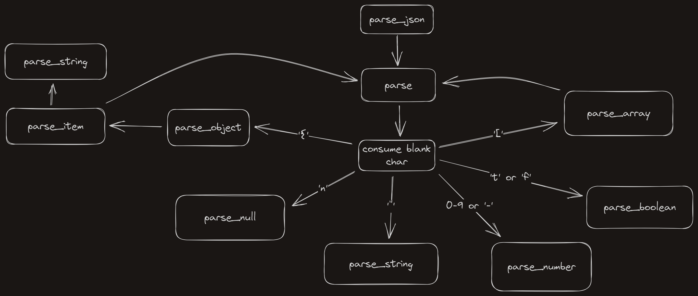

# C-JSON-Parser

## WARINING: WORK IN PROGRESS

## Instalation

Debug object:
~~~ bash
cd c_json_parser
make
~~~

Release object:
~~~ bash
cd c_json_parser
make release
~~~

## Usage
Add `#include "<path_to_c_json_parser>/headers/c_json_parser.h"` at the top of the file.

Compile your project with `c_json_parser.o` object. This object is in c_json_parser/obj folder.

### **WARNING**
JSON objects are allocated dynamcally. Makes sure to properly freeing JSON variables using *c_json_free* function to avoid memory leaks.

### Parse a JSON string
Firstly, parse the string using the *parse_json* function.
~~~ C
JSONRoot root;
if( parse_json(&root, string) == -1)
    exit(-1);
/* do something */
~~~
### Retriving values
#### Primitive types
If you want to retrive a value, you can use the *get_value* function if the type is already known or check the type with *get_type* function.

#### JSON objects
For getting values from JSON objects you may use the *get__* functions.
~~~ C
JSONObject obj;
JSONValue* val;

val = get_key_value(&obj, "key", NULL);

~~~

Or if you expect a more spcific type...
~~~ C
JSONObject obj;
char* string;

string = get_string(&obj, "key", NULL);
~~~

### Free memory
When the parsed JSON is no longer needed, you may free the dynamic allocated memory using *c_json_free* function.

~~~ C
JSONRoot root;

/* Parses and uses JSONRoot */

// Freeing memory
c_json_free(&root);
~~~

## Logic

# License
C-JSON-Parser is released under the [MIT License](./LICENSE)